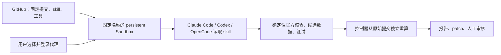

# Varzia：Sandbox 内的 agent + skill 架构思路

本次只把设计放在 GitHub，供以后自行配置和审核。PR6 中已有 Codex executor 是先前的实现提案，尚未合并；它的单次临时 VM、重复登录限制不代表 Vercel 平台限制。本次不扩展实现，也不配置 VM、登录、快照、凭据或模型调用。

## 各部分负责什么

GitHub 保存经过审核的 skill、确定性核验工具、测试和设计。用户在自己的 Vercel Sandbox 中选择并登录 Claude Code、Codex 或 OpenCode，让真正的 agent 读取 skill、调用工具、检查证据并准备修改。默认由用户触发单次任务，执行已审核 revision；外层控制器独立验证结果，交付 patch 或 draft PR，合并和部署仍由人决定。

[Vercel 官方页面](https://vercel.com/sandbox)明确列出预装的 `claude`、`codex`、`opencode`。预装 CLI 与代理账号、模型额度是分开的：首次登录由用户在 Sandbox 内完成，使用哪种订阅、API 或 provider 由用户选择，不自动切换付费路线。[universal 镜像](https://vercel.com/docs/sandbox/concepts/images)随夜间发布更新；恢复旧快照不会因此自动升级已保存的 CLI，应记录实际版本并安排受控更新。

## 固定名称，停止后继续用

在用户指定的 Vercel project 内固定一个名称，例如 `varzia-agent`；名称在该 project 内唯一。采用原生 persistent Sandbox，无需自建快照恢复服务。推荐通过 `Sandbox.getOrCreate({ name, persistent: true, ... })` 获取环境：

1. `onCreate` 只在新建时做初始化。用户首次进入后，自行选择代理并完成其官方登录。
2. 每次任务都锁定已审核的完整 Git SHA，创建干净工作副本、清理上次任务目录，并核对 skill、工具和运行边界。保留依赖及私有账号缓存，不重复初始化整个环境。
3. 已有环境可用 `resume: true` 立即恢复；也可先 `resume: false` 取得句柄、用 `sandbox.update()` 重申网络、超时和保留策略，再运行命令触发恢复。**已有环境不会采用 `getOrCreate` 传入的新配置**，必须显式 `update`。
4. `onResume` 适合恢复后的检查和进程启动；若 VM 本来已运行，该 hook 不会代替每次任务检查。文件系统会恢复，代理和后台服务进程需要重新启动。
5. 任务结束后清理任务临时文件、收紧网络并 `stop()`。原生 persistent 模式在 stop 或 session 超时后自动保存文件系统，下次从最新快照恢复。停止计算不等于删除环境或退出代理账号。

以上生命周期和 SDK 3.5.1 的 `getOrCreate`、`onCreate`、`onResume`、`update` 已交叉核对。[官方 Persistence 文档](https://vercel.com/docs/sandbox/concepts/persistent-sandboxes)

快照默认在**最后使用后 30 天**过期，使用会重置计时；`0` 表示无限保留，不能默替用户选择。只需最新状态时，可选 `keepLastSnapshots: { count: 1, deleteEvicted: true }`，并明确 TTL。失效后 `getOrCreate` 可同名重建，此时环境和登录缓存也要重新建立。手动 `snapshot()` 会停止当前 session；删除 Sandbox 默认不删除快照，退出使用时需要一并清理相关快照。[官方 Snapshots 文档](https://vercel.com/docs/sandbox/concepts/snapshots)

## 共用任务契约，各代理单独适配

任务内容共用，适配层负责 skill 放置/调用、模型配置、权限、认证状态、事件和用量解析，不能把一个代理的 flags 或 frontmatter 当成全部代理通用。建议契约为：

| 项目 | 契约 |
| --- | --- |
| 输入 | 已审核 Git SHA、`check` / `update`、冻结 UTC 时间、选定代理/模型、超时与网络策略 |
| skill | 先加载指定 skill，再执行官方核验、阅读证据、检查候选 diff、运行测试并报告；模型真实参与判断和执行 |
| 工具 | `node scripts/prime-resurgence-agent-tool.mjs --mode MODE --now TIME`，复用现有确定性 updater；`check` 只读，`update` 只生成 provisional 候选 |
| 校验 | `npm run verify`、`npm run check:locales`；缺失证据、来源冲突或检查失败即 blocked，不猜数据、不修改验证器 |
| 输出 | `ready` / `blocked`、官方证据、实际命令结果、警告；外层再决定是否导出审查产物 |

现有 [SKILL.md](../.agents/skills/varzia-official-update/SKILL.md)和[工具入口](../scripts/prime-resurgence-agent-tool.mjs)可作为契约起点。

| 代理 | 已核实的 skill / 执行方式 | 需要适配的地方 |
| --- | --- | --- |
| Codex | 仓库 `.agents/skills/<name>/SKILL.md`；显式调用 skill；非交互入口 `codex exec --json` | Codex permission profile、模型 ID、JSONL/schema、`CODEX_HOME`；现 PR 只有此代理的实现提案。[skills](https://learn.chatgpt.com/docs/build-skills)、[执行](https://learn.chatgpt.com/docs/non-interactive-mode) |
| Claude Code | 项目 `.claude/skills/<name>/SKILL.md`；用 `/skill-name`，`claude -p` 支持在 prompt 中展开该调用 | 可生成同一任务内容的 Claude skill；`allowed-tools`、调用开关和权限配置单独审核；JSON/stream-json 与 Codex 不同。[skills](https://code.claude.com/docs/en/skills)、[执行](https://code.claude.com/docs/en/headless) |
| OpenCode | 支持 `.opencode/skills/`，也发现 `.agents/skills/` 和 `.claude/skills/`；通过 skill 工具按需加载；`opencode run --format json` | 只识别其文档列出的 frontmatter，未知字段会忽略；permission、`provider/model`、事件解析单独适配，不能继承 Claude 字段的权限含义。[skills](https://opencode.ai/docs/skills/)、[CLI](https://opencode.ai/docs/cli/) |

启动时只加载受审核的配置，禁用未授权 hooks、插件、MCP 和额外代理；发现能力差异就停止或报告未支持。特别是 Claude 的 `--bare` 会忽略订阅 OAuth，不能为了隔离配置而静默换成 API 计费模式。其安全启动方式必须与用户选定认证路线一起设计；本次不实现适配器。

## 登录、缓存与费用边界

凭据只在用户自己的 Sandbox 内产生和保存，位于仓库以外的代理私有目录；GitHub 不保存 token、登录缓存、登录日志或含凭据的产物。不复制 Mac 上的认证文件。

| 代理 | 官方缓存位置 / 认证说明 |
| --- | --- |
| Codex | 文件模式为 `$CODEX_HOME/auth.json`；可把 `CODEX_HOME` 指向仓库外的私有持久目录。远端可由用户自行完成 device-code 登录。[认证](https://learn.chatgpt.com/docs/auth) |
| Claude Code | Linux 为 `~/.claude/.credentials.json`，或 `CLAUDE_CONFIG_DIR` 下的该文件；官方文件模式为 `0600`。订阅和 API 等认证来源有优先级，应核实当前实际方式。[认证](https://code.claude.com/docs/en/authentication) |
| OpenCode | provider 凭据存于 `~/.local/share/opencode/auth.json`；由用户用 `/connect` 选择提供方和认证方式。不同提供方的订阅支持、额度和条款要分别核对。[providers](https://opencode.ai/docs/providers/) |

持久化会把这些缓存一起保存进 Vercel project 的云端快照。适配层应保留代理正常刷新后的**最新缓存**，不每次覆盖成旧 token；一份认证只供一个受信任环境串行使用，不 fork 含凭据的快照、不让并发任务共用缓存。固定名称不是任务锁，控制器应按 project/name 互斥，已有任务就排队或拒绝。失效或撤销后由用户重新登录，不自动寻找其他凭据。

Codex 的[账号认证自动化指南](https://learn.chatgpt.com/docs/auth/ci-cd-auth)明确限定受信任私有自动化，并写明不要将该工作流用于 public / open-source repositories。Varzia 是公开仓库，不能仅把 runner 称为 private 就宣称这条无人值守认证路线适用；普通远端交互登录的支持也不等于批准该自动化方案。本设计保留用户自行选择和登录代理的入口，**没有启用持久订阅凭据自动化**；以后落地时还需核实选定代理/提供方的适用范围。

保留登录可避免反复设置，但快照应视为包含敏感凭据。能操作该 project 的 Sandbox、读取文件或恢复/复制快照的主体可能取得账号缓存；仓库内的 skill 禁令本身不能隔离这些权限。未来配置时需明确 project/访问者、缓存位置、TTL、单实例策略，以及退出登录、账号端撤销和删除全部相关快照的流程。[Sandbox 认证](https://vercel.com/docs/sandbox/concepts/authentication)

Vercel 的计算和快照存储与代理模型额度分开计量；停止 VM 后，保留的快照仍占存储。是否使用订阅、API、Gateway 或其他提供方，以及实际费用，由用户在配置时决定。本次不创建收费资源、不发起模型调用。[Sandbox 定价](https://vercel.com/docs/sandbox/pricing)

## 独立验证与可审核产物

agent 工作副本与控制器原始副本分开。源码和 skill 在执行前审核并固定 SHA；官方网页、上游 JSON、仓库说明及测试输出均不能扩大权限。agent 只可经确定性工具改四个受管 JSON，不能改源码、测试、locale、依赖、认证或发布状态。

控制器从原始提交按同一冻结时间重新获取官方证据、重算数据，要求四个文件逐字节一致，再独立跑测试、locale、路径/文件类型及发布规则检查。原有 fail-closed 来源一致性、VM 超时清理、受限导出和人工发布流程继续作为边界；切换代理不改变它们。私有认证和控制文件需要实际 OS/代理权限保护，并在每次运行前验证，不能只写在 prompt 里。

运行网络分阶段限制为源码读取、官方核验以及用户选定代理必需的账号/模型域名；源码或上游内容不能新增域名、传入 secret 或开启发布权限。每次任务有独立 deadline、输出上限和用量记录。token/费用统计是观察值，不能把运行后拒收结果称为事前硬性费用上限。

成功产物为受限数据 patch、官方证据摘要、测试结果和脱敏报告；报告记录 SHA、skill 哈希、代理/CLI/模型、冻结时间、来源、命令退出码、用量（不支持时标 unknown）、Sandbox/session 身份和停止/保存结果。失败只导出脱敏诊断，不批准候选文件；异常超时可能保存未完成状态，下次必须清理并从已审核提交重建任务副本。patch 或 draft PR 由用户/外层已授权流程提交，agent 不持有 GitHub 写权限，不能自行 merge 或 deploy。

## 后续实施范围

若以后继续：先确认代理及其认证适用范围，再为原生 named Sandbox 和各代理适配器补 mock 测试，覆盖首次创建、恢复、配置更新、缓存刷新/失效、快照过期重建、并发拒绝及失败清理；最后在用户明确选择资源和认证方案后，才做真实环境验证。本次交付止于这份设计文档。

官方资料与本地 SDK 接口核对日期：2026-10-02。文中拟议适配行为不代表已在三种代理或真实 Sandbox 中验证。
